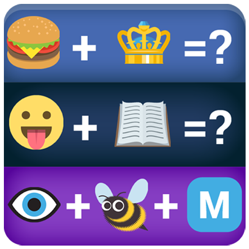

# CS50: Scratch 0: Emoji Island Game 😀

## Description

It’s time to choose your own adventure! The assignment is to implement in Scratch, at scratch.mit.edu, any project of your choice, be it an interactive story, game, animation, or anything else, subject only to the following requirements:

- Your project must use at least two sprites, at least one of which must not be a cat.
- Your project must have at least three scripts total (i.e., not necessarily three per sprite).
- Your project must use at least one conditional, at least one loop, and at least one variable.
- Your project must use at least one custom block that you have made yourself (via Make a Block), which must take at least one input.
- Your project should be more complex than most of those demonstrated in lecture (many of which, though instructive, were quite short) but it can be less complex than Oscartime and Ivy’s Hardest Game.

To meet these requirements, your project should probably use a few dozen puzzle pieces overall. And your code should ideally be not only correct but also well-designed. And try to leverage “abstraction” where possible: if you can imagine giving a descriptive name to a sequence of blocks (e.g., meow), those could probably be moved to a custom block!

## Emoji Island Game: Candy Edition

The aim of the **Emoji Island Game** is to look at the set of emojis and decipher what the emojis mean. Go through each set to be scored. 

### How To:

1. Press Green Flag
2. Review Set of Emojis
3. Type Answer
4. PLAY AGAIN!!!!

Example:🦁 👑
 Answer: Lion King.

# Enter: [Emoji Island Game](https://scratch.mit.edu/projects/740543299/)

- Number of Game Sprites: 7
- Audio: Loop
- Scripts: 19
- Conditional logic, two variables
- Custom blocks - Emoji Island

